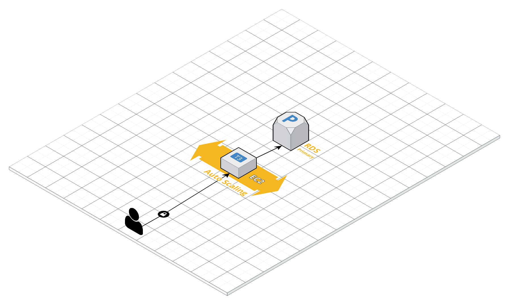
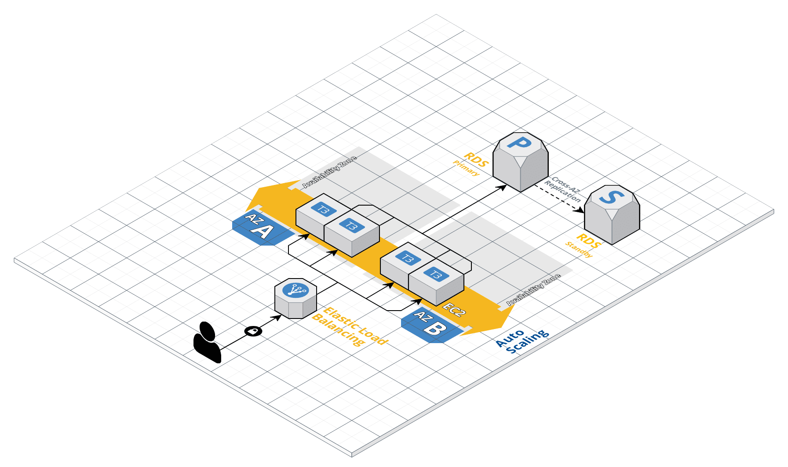

# Twitch clips test task
Architecture:
* Java 11
* Spring Boot
* REST API
* OAuth with New Twitch API
* PosgreSQL DB provided by Heroku  
* For the sake of simplicity, FE is done without any fancy JS frameworks. Only HTML and Java template engine Freemarker
* App is deployed to Heroku at: https://shuman-stonks.herokuapp.com/ 

# Constrains
- Design is ugly
- Spent way more time than 4 hours, didn't have time to create tests, which is unacceptable for PROD app.
- DB and Twitch secrets are exposed in application.yml that is available in a public GitHub repo. Should encrypt secrets and/or provide them as startup variables.
- Twitch claims one can get clips from API without OAuth token, but in reality it's forbidden. I had to get an App Token (do not confuse with user Access Token) and save it to application.yaml. It will expire in 60 days.

# AWS Architecture
#### Small app (100 reqs/day)

#### Large app (900M reqs/day)
